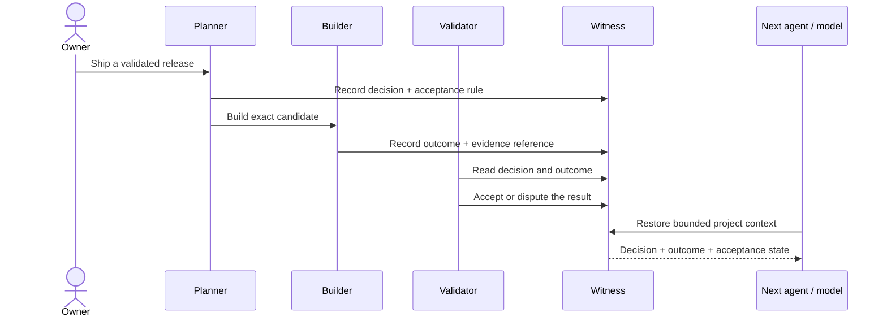
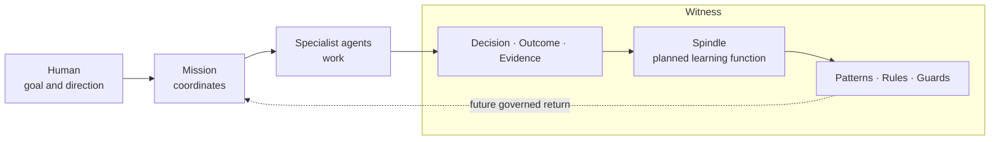

# Witness Evidence

## Open Evidence Layer for Agentic Systems

**Your agents can act. Witness preserves what was decided, which evidence was attached, and what the next agent may inherit.**

AI agents can act. Witness makes their work accountable.

Agents are becoming a software workforce. Their accepted truth is still too often trapped in a chat log: a planner chooses a direction, a builder reports “done,” a validator arrives later, and the next model has to reconstruct why anyone trusted the result.

Witness Evidence is for **agent-platform and AI-infrastructure engineers** whose agents, models, and traces are growing faster than their ability to preserve accepted project state. It records identity-bound decisions, attached evidence, outcomes, lifecycle changes, and bounded project context through MCP.

> **Delegate execution without delegating truth.**

[Run the real local demo of the v0.1.0 core](#run-the-real-demo) · [See what runs today](#runs-today) · [Explore the capability roadmap](ROADMAP.md) · [Inspect proof status](EVIDENCE.md)

## Where Witness fits

```text
MCP connects agents to tools.
A2A connects agents to agents.
Traces show what ran.
Durable runtimes keep workflows alive.
Witness preserves what was decided, which evidence was attached, which status transitions followed, and what the next agent may inherit.
```

Witness does not replace agent runtimes, tracing, orchestration, Git, or observability. It sits above execution detail as a durable evidence boundary: the place where a team records the decision it acted on, the result it produced, an evidence reference, the identity that performed each status transition, and the context a later agent is allowed to recover.

## The failure mode

Without a shared evidence layer, a multi-agent system becomes a pile of confident transcripts:

```text
Planner:   “Build the release.”
Builder:   “Done.”
Validator: “Which bytes? Which requirements? Why this design?”
Next run:  “I have no context from the previous chat.”
Owner:     reconstructs everything by hand.
```

The durable object should not be the conversation. It should be the witnessed project state.

## Runs today

Version `0.1.0` executes a local, open-source evidence core:

- 10 MCP tools for projects, decisions, insights, outcomes, records, lifecycle, bounded context, and FTS5 search;
- signed agent identity envelopes bound to the exact tool, request payload, tenant, profile, runtime generation, and nonce;
- role-based default-deny access and idempotent mutations;
- privacy redaction before persistence;
- SQLite persistence with transactional append-only operations audit;
- a real local flow with separate builder and validator identities;
- reproducible Apache-2.0 release artifacts and a staged fresh-install doctor.

In the included demo, a distinct synthetic validator identity moves the outcome to `verified`. The transition records that actor and its reason. Version `0.1.0` does **not enforce builder/validator separation**, expose the outcome's `based_on` evidence reference through the public read projection, fetch the referenced artifact, or decide correctness automatically. This is **not automatic evidence verification**.

## See the system move



The repository includes a **real local MCP flow**. It creates a temporary database, uses separate signed synthetic builder and validator identities, writes a decision and outcome, moves the outcome from `recorded` to `verified`, and restores project context.

```text
[1/3] Decision recorded: require independent validation
[2/3] Outcome verified by a distinct validator identity
[3/3] Project context restored from the database
WITNESS_DEMO_PASS decisions=1 outcomes=1 outcome_status=verified distinct_validator=true context_restored=true
```

**Evidence class: real local product flow.** The demo executes the public MCP server and persistence layer with synthetic credentials. It is not a cloud screenshot, a simulated response, or proof of an external integration.

## Run the real demo

```bash
git clone https://github.com/MaximilianoColoma/witness.git
cd witness
uv sync --locked
uv run python examples/coordinated_autonomy_demo.py
```

Expected final line:

```text
WITNESS_DEMO_PASS decisions=1 outcomes=1 outcome_status=verified distinct_validator=true context_restored=true
```

## What this enables

### Accountable builders

A builder can produce work and a different identity can perform the later review transition, as the demo shows. Teams must enforce any required builder/validator separation in their own policy until Witness adds that invariant.

### Model-independent continuity

Replace the model, restart the process, or resume next week. A later agent can retrieve bounded project objects instead of reverse-engineering an old transcript.

### Evidence-aware gates

Decisions, outcomes, receipts, and status transitions become queryable inputs to CI, release governance, incident review, and human approval.

### Memory with boundaries

Witness is not a transcript dump or a generic RAG store. It persists declared project objects, redacts supported PII before persistence, bounds reads, and denies undeclared authority.

### Audit that ordinary product calls cannot casually rewrite

Public-core mutations and audit events commit together or not at all. Canonical triggers protect operations history from update and deletion through the normal application path.

## Building next

### Cross-model project continuity

The next developer capability is a portable continuity contract: Claude, Codex, GPT, local models, and specialist agents should be able to use the same bounded Witness project state and continue work without access to the original chat.

This is **planned, not yet externally proven**. The proof requires a different agent team to reconstruct the current decision, attached evidence, and acceptance state; reconstruction time and failure cases must be measured. See [EVIDENCE.md](EVIDENCE.md#cross-model-project-continuity--planned-proof).

No first-party adapters for Claude, Codex, OpenAI Agents SDK, LangGraph, or Temporal ship in v0.1.0. Today those systems can reach Witness only through custom MCP/client wiring built by the integrator. Documented reference adapters are roadmap work, not current functionality.

## North star

Witness aims to become the open evidence and learning infrastructure through which an agent organization retains what it decided, proved, and learned across agents, models, runs, and systems.

That north star includes portable verification and **verified learning return**: accepted outcomes may inform later work without allowing unverified text to silently become policy. It is **not automatic cross-model learning** in v0.1.0.

### Two-product architecture

Mission is a separate product. Spindle is the planned learning function inside Witness.

**Mission coordinates agent work. Witness preserves evidence and is designed to compound verified learning.**



The **Evidence Core runs today. The full Spindle learning loop is planned.** Its future job inside Witness is to take outcomes in Witness's `verified` lifecycle status and, after additional eligibility and review gates, turn them into governed learning candidates, reusable patterns, rules, and guards for later Mission runs. The status records an acceptance transition; it does not by itself prove that Witness fetched or independently validated the underlying evidence. Version `0.1.0` does not generate those artifacts or feed them back automatically.

### Dream functions

These are **enabled patterns, not bundled orchestration** today:

- cross-model continuity without transcript access;
- portable proof that an external validator can inspect without trusting the builder’s narration;
- verified learning return through Spindle, the planned internal Witness learning function;
- owner-readable autonomy with a durable decision chain;
- incident memory that carries accepted root cause and prevention into later missions.

**Every token should leave the system more valuable than before.** That is the product direction, not a current efficiency or economic claim.

Mission and Witness are the two main products. Mission coordinates work; Witness owns the evidence boundary and the planned Spindle learning function. No automatic Witness-to-Mission learning return ships in `v0.1.0`.

## Built now — and not yet

| Runs in v0.1.0 | Building next / later |
|---|---|
| 10 MCP tools and local SQLite persistence | First-party Claude, Codex, OpenAI Agents SDK, LangGraph, and Temporal recipes |
| Signed identity envelopes and request binding | Externally proven cross-model continuity |
| Role-based default-deny access | Portable external artifact verification |
| PII redaction and bounded reads | Multi-tenant hosted service |
| Transactional append-only operations audit | Full Spindle learning loop inside Witness |
| Real local demo of the release-core source; reproducible v0.1.0 assets | Automatic Mission bridge, SaaS, billing, or customer outcomes |

The service is **not deployed** by this repository. Publication and green CI do not prove production operation, scale, savings, or user impact.

## Public MCP surface

| Intent | Tools |
|---|---|
| Establish a project | `tool_register_project` |
| Preserve reasoning | `tool_log_decision`, `tool_log_insight` |
| Preserve results and receipts | `tool_log_outcome`, `tool_log_record` |
| Govern lifecycle | `tool_update_status` |
| Restore context | `tool_get_entry`, `tool_get_context_for` |
| Inspect history | `tool_query_log`, `tool_query_log_fts5` |

Canonical contracts live under [`spec/`](spec/). FTS5 is local text search, not semantic or vector search.

## Install and verify

Requires Python 3.11+ and [uv](https://docs.astral.sh/uv/).

```bash
./install.sh --manifest --json
./install.sh --target "$HOME/.local/share/witness" --non-interactive --json
uv sync --locked
uv run python -m pytest -q -p no:cacheprovider tests repair-tests
uv build
```

The staged installer scrubs inherited Python environment variables, performs a locked installation, writes bounded local configuration and storage, and runs a real MCP first-run doctor.

## Naming and technical identity

**Witness Evidence is the public-facing qualifier; technical identifiers remain unchanged.** The repository `MaximilianoColoma/witness`, package `witness-public`, Python module `witness_public`, MCP tool names, contracts, and released `v0.1.0` artifacts keep their existing technical identifiers. In short: the story is clearer; the wire stays put.

An unrelated established project also uses the name Witness. See [TRADEMARKS.md](TRADEMARKS.md#unrelated-witness-project) for the anti-confusion notice.

## Project center

- Capability roadmap: [`ROADMAP.md`](ROADMAP.md)
- Evidence and proof status: [`EVIDENCE.md`](EVIDENCE.md)
- Governance and release authority: [`GOVERNANCE.md`](GOVERNANCE.md)
- Contributions and DCO: [`CONTRIBUTING.md`](CONTRIBUTING.md)
- Security reporting: [`SECURITY.md`](SECURITY.md)
- Support boundaries: [`SUPPORT.md`](SUPPORT.md)
- Naming and anti-confusion: [`TRADEMARKS.md`](TRADEMARKS.md)

## License

Licensed under the [Apache License 2.0](LICENSE). See [`NOTICE`](NOTICE). Apache-2.0 permits use, modification, redistribution, and commercial use; it does not grant permission to imply official project status or trademark endorsement.
