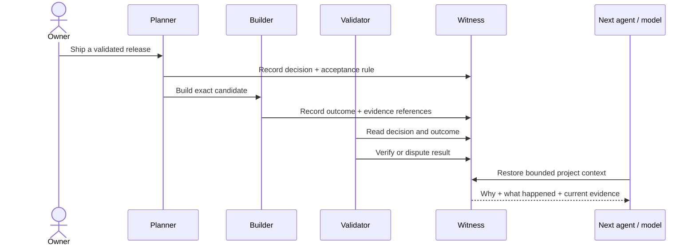

# Witness

## AI agents can act. Witness makes their work accountable.

A model can write code, call tools, and hand work to another model. But when the chat disappears, what survives?

Witness turns agent work into durable, inspectable project memory: **decisions, evidence, outcomes, records, identity, and history** — exposed through MCP.

> The builder can say “done.” Witness preserves what was decided, what actually happened, and what the next agent can verify.

[Run the real demo](#run-the-real-demo) · [Explore the roadmap](ROADMAP.md) · [Install v0.1.0](https://github.com/MaximilianoColoma/witness/releases/tag/v0.1.0)

## The failure mode

Without a shared evidence layer, a multi-agent system slowly becomes a pile of confident transcripts:

```text
Planner:   “Build the release.”
Builder:   “Done.”
Validator: “Which bytes? Which requirements? Why this design?”
Next run:  “I have no context from the previous chat.”
Owner:     reconstructs everything by hand.
```

With Witness, the durable object is not the conversation. It is the witnessed project state.

## See the system move



The repository includes a **real local MCP flow**. It creates a temporary database, uses separate signed synthetic builder and validator identities, writes a decision and outcome, moves the outcome from `recorded` to `verified`, then restores project context.

```text
[1/3] Decision witnessed: builder cannot validate its own release
[2/3] Outcome verified by a distinct validator identity
[3/3] Project context restored from the database
WITNESS_DEMO_PASS decisions=1 outcomes=1 outcome_status=verified distinct_validator=true context_restored=true
```

**Evidence class: real local product flow.** The demo exercises the actual public MCP server and persistence layer with synthetic credentials. It is not a cloud screenshot or a simulated response.

## Run the real demo

```bash
git clone https://github.com/MaximilianoColoma/witness.git
cd witness
uv sync --locked
uv run python examples/coordinated_autonomy_demo.py
```

## What this enables

### Accountable builders

A builder can produce work while a different agent validates it against the original decision and evidence. Execution and acceptance no longer have to live in the same model context.

### Model-independent continuity

Replace the model, restart the process, or resume next week. The next agent can retrieve bounded project context instead of reverse-engineering an old chat.

### Evidence-aware release gates

Decisions, outcomes, receipts, and status transitions become queryable inputs to CI, release governance, incident review, and human approval.

### Memory with boundaries

Witness is not an unbounded transcript dump. The public core stores declared project objects, redacts supported PII before persistence, uses bounded reads, and denies undeclared authority.

### An audit trail agents cannot casually rewrite

Public-core mutations and audit events commit together or not at all. Canonical triggers protect append-only operations history from update and deletion.

## Dream functions

These are **enabled patterns, not bundled orchestration** in v0.1.0:

- **Autonomous software factories** where every release can answer who decided, who built, what was tested, and what evidence passed.
- **Cross-model continuity** where Claude, GPT, local models, and specialist agents can change seats without losing project truth.
- **Self-improving agent organizations** where verified outcomes can later feed a learning layer instead of disappearing into chat history.
- **Owner-readable autonomy** where a human can ask “Why did the system do this?” and receive the recorded decision chain.
- **Incident memory** that carries root cause and prevention into the next run rather than rediscovering the same failure.
- **Portable proof** where an external validator can inspect released evidence without trusting the builder's narration.

Witness provides the evidence substrate. Scheduling agents, spawning builders, automatic learning, and cross-product bridges are separate layers.

## Built now — and not yet

| Built in the public core | Not included in v0.1.0 |
|---|---|
| 10 MCP tools for projects, decisions, insights, outcomes, records, lifecycle and search | Hosted cloud service or production deployment |
| Signed identity envelopes and request binding | Multi-tenant SaaS isolation |
| Role-based, default-deny access | Billing, seats, usage metering |
| SQLite persistence and local FTS5 search | Semantic/vector search |
| PII redaction before persistence | Spindle or automatic self-improvement |
| Transactional append-only audit | Mission-to-Witness automatic bridge |
| Reproducible Apache-2.0 release artifacts | Customer outcome claims |

Version `0.1.0` is a validated public release. The service is **not deployed** by this repository, and publication is not a production-support or user-impact claim.

## Public MCP surface

| Intent | Tools |
|---|---|
| Establish a project | `tool_register_project` |
| Preserve reasoning | `tool_log_decision`, `tool_log_insight` |
| Preserve results and receipts | `tool_log_outcome`, `tool_log_record` |
| Govern lifecycle | `tool_update_status` |
| Restore context | `tool_get_entry`, `tool_get_context_for` |
| Inspect history | `tool_query_log`, `tool_query_log_fts5` |

The canonical contracts live under [`spec/`](spec/). FTS5 is local text search, not semantic or vector search.

## Install and verify

Requires Python 3.11+ and [uv](https://docs.astral.sh/uv/).

```bash
./install.sh --manifest --json
./install.sh --target "$HOME/.local/share/witness" --non-interactive --json
uv sync --locked
uv run python -m pytest -q -p no:cacheprovider tests repair-tests
uv build
```

The staged installer scrubs inherited Python environment variables, performs a locked installation, writes bounded local configuration/storage, and runs a real MCP first-run doctor.

## Project center

- Product roadmap: [`ROADMAP.md`](ROADMAP.md)
- Governance and release authority: [`GOVERNANCE.md`](GOVERNANCE.md)
- Contributions and DCO: [`CONTRIBUTING.md`](CONTRIBUTING.md)
- Security reporting: [`SECURITY.md`](SECURITY.md)
- Support boundaries: [`SUPPORT.md`](SUPPORT.md)
- Official naming and forks: [`TRADEMARKS.md`](TRADEMARKS.md)

## License

Licensed under the [Apache License 2.0](LICENSE). See [`NOTICE`](NOTICE). Apache-2.0 permits use, modification, redistribution, and commercial use; it does not grant permission to imply official project status or trademark endorsement.
